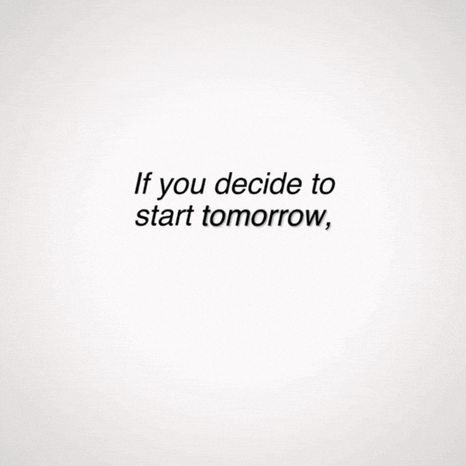

# 👋 Hey, I'm Caio

### Software Engineering Student @ Inatel

 

  

`software development` • `backend` • `data` • `devops`

---

## 💻 About Me

🎓 Software Engineering student at **Inatel**

💻 Focused on **software development and backend**

🐍 Working with **Python and data analysis**

☕ Developing applications with **Java**

⚙️ Learning and applying **testing, software architecture and DevOps**

🚀 Always building new projects and improving my skills

 
 
 

---

## ⚡ Languages

  

`Java` • `C++` • `TypeScript` • `Python` • `JavaScript`

---

---

## 🛠️ Technologies

  

---

## 📊 GitHub

---

## 🔥 Activity

---

---

## 📫 Contact

  

